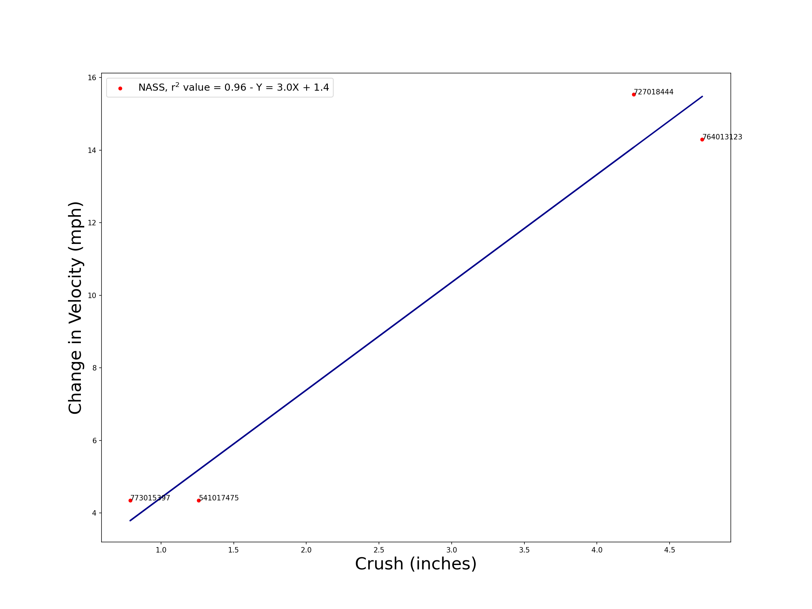

[Back to SDP Overview](README.md)

---

# Requirements Specification

## Functional Requirements

1. Case Filtering
    1. The user will be able to use filters to narrow the data down to a subset of cases that meet certain criteria
    2. The main filtering options will be:
        - Start Year
        - End Year
        - Make
        - Model
        - Delta V from
        - Delta V to
        - Primary Damage
        - Secondary Damage
    3. Other options will be available in an "Other Options" menu. Each of these "other" options can be viewed on the [Crash Viewer site](https://crashviewer.nhtsa.dot.gov/LegacyCDS/Search)

2. Multiple Analysis
    1. The user will be able to save more than one case for analysis at a time
    2. The results of the multi-case analysis will be updated in real time as the user adds or removes cases. Immediate results include:
        - The Case ID (and corresponding image ID)
        - Average crush in inches
        - NASS Delta-V
        - NASS vc (not sure what this means)
        - Total Delta-V
    3. The user may also view a scatterplot (change in velocity vs. crush) of the selected cases, complete with an equation for the line of best fit and an R^2 value. This scatterplot will also be updated in real time as the user adds or removes cases. An example scatterplot is shown below: 
    

3. Export to CSV
    1. The user will be able to export the results of the multi-case analysis to a CSV file
    2. The CSV file will include the following data:
        - Case ID
        - Case Number
        - Vehicle Number
        - Year
        - Make
        - Model
        - Curb Weight
        - Damage Location
        - And more... (see the [example file](data.csv))

4. Saving Case Profiles
    1. Upon exiting the application or clicking the "Save" button, the user will be prompted to save the current case profile
    2. This case profile will save all the information that the user has entered, any data or images from the NASS database, as well as any graphs, computed data, or other files that have been generated
    3. The user will be able to load a saved case profile at any time, and the application will return to the state it was in when the profile was saved
    4. The user will be able to delete a saved case profile at any time

5. Image Viewing
    1. Users will be able to import their own images to be viewed alongside the NASS images for easier case selection
    2. Users can choose to view the NASS images, their own images, or both. If both are selected, the images will be displayed side-by-side, depending on the area of damage
    3. Users can filter out which images they want to view based on the area of damage

## Non-Functional Requirements

1. Database Caching
    1. The application will be able to cache parts of the NASS database locally to improve performance
    2. There will be an option to cache the entire database, or only a subset of the database based on the user's filtering options
        - Caching the entire database is expected to take 30-45 minutes. This was estimated based on the observed response time of the NASS Crash Viewer site. However, this would only be a one-time process, and should only have to be repeated if the database changes (which is unlikely, since NASS/CDS has been replaced by CISS).

2. Parallelization
    - The application will take advantage of multiple cores so that GUI operations and database operations can be performed simultaneously
    - The application will be able to make multiple requests to the NASS database at once to cut down wait times

## Assumptions and Constraints

- Cases from 1979-2003 are unavailable through the [NASS/CDS Crash Viewer](https://crashviewer.nhtsa.dot.gov/LegacyCDS/Search)
    - All NASS/CDS data is available via the [NASS/CDS FTP site](https://www.nhtsa.gov/file-downloads?p=nhtsa/downloads/NASS/) (images not included)
- Images for cases from 1979-1996 seem to be completely inaccessible
- Images for cases from 1997-2003 are only available via the [NASS/CDS image viewer](https://crashviewer.nhtsa.dot.gov/LegacyImageCDS/SearchIndex), which may cause some headaches with scraping
- Data from 2016-Current is inaccessible through the NASS/CDS database, and must be accessed via the [CISS FTP site](https://www.nhtsa.gov/file-downloads?p=nhtsa/downloads/CISS/) (images not included) or the [CISS Crash Viewer](https://crashviewer.nhtsa.dot.gov/CISS/SearchFilter)

---

[Back to SDP Overview](README.md)