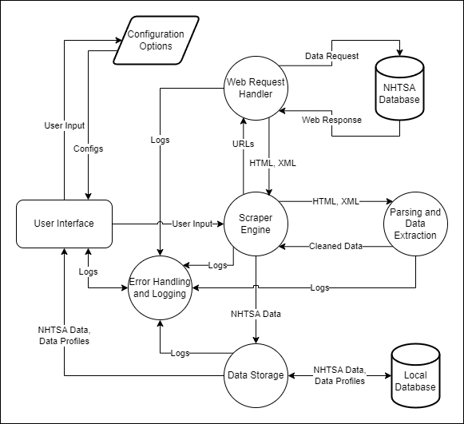

[Back to SDP Overview](README.md)

---

# System Design Document

## Architecture Overview

The NHTSA CrashViewer scraper tool consists of several components. The user iterface allows users to interact with the application, specifying search criteria and options, as well as viewing the actual scraped data. The scraper engine serves as the core component, coordinating the scraping process by managing workflow and interactions between other components. A web request handler makes requests to the NASS/CDS crashviewer site, utilizing parallelization techniques to ensure efficiency. The parsing and data extraction component processes web responses, extracting all relevant information, and performs any necessary mathematical calculations. The scraped data is then cached in a local database with help of the data storage component. Error handling and logging ensures proper exception handling and records any important events. Configuration options enable users to customize settings related to the scraping process. Together, these components form a cohesive architecture that facilitates efficient and controlled scraping of data from the NASS/CDS crashviewer site.

## Component Descriptions

1. **User Interface**
    - **Purpose:** Provides a Graphical User Interface (GUI) for the user to interact with the application. The user interface allows users to specify search criteria and options, as well as view the actual scraped data.
    - **Interfaces:** Scraper Engine, Data Storage, Error Handling and Logging, Configuration Options
    - **Dependencies:** PyQt6
    - **Interaction Flow:** The user interface receives either direct user input or input from a user profile, which can be retrieved via the Data Storage component. This information is forwarded to the Scraper Engine, which processes the input and returns the results to the user interface. If the logger is enabled, the user will be able to view any logged events, which are retrieved from the Error Handling and Logging component. At any time that the scraping engine is not active, the user interface also allows the user to customize scraping settings, which are then forwarded to the Configuration Options component.

2. **Scraper Engine**
    - **Purpose:** Coordinates the scraping process by managing workflow and interactions between other components.
    - **Interfaces:** All components
    - **Dependencies:** None
    - **Interaction Flow:** The scraper engine receives input from the user interface, which is then processed and forwarded to the Web Request Handler. The scraper engine then receives response data from the Web Request Handler, which is processed and forwarded to the Parsing and Data Extraction component. The scraper engine then receives the extracted data from the Parsing and Data Extraction component, which is finally forwarded to the Data Storage component. During the scraping process, the scraper engine will be checking the Configuration Options component to further customize the scraping process.*

3. **Web Request Handler**
    - **Purpose:** Makes requests to the NASS/CDS crashviewer site, utilizing parallelization techniques to ensure efficiency.
    - **Interfaces:** Scraper Engine, Configuration Options, NAAS/CDS Crashviewer Site, Error Handling and Logging
    - **Dependencies:** Requests, concurrent.futures
    - **Interaction Flow:** The web request handler receives input from the scraper engine, which is processed into a request to the NASS/CDS crashviewer site. Multiple requests will be sent in parallel, utilizing as many cores as the user wants available, which is configured via the Configuration Options component. The web request handler then receives the response data from the NASS/CDS crashviewer site, which is processed and forwarded back to the scraper engine.*

4. **Parsing and Data Extraction**
    - **Purpose:** Processes web responses, extracting all relevant information, and performs any necessary mathematical calculations.
    - **Interfaces:** Scraper Engine, Configuration Options, Error Handling and Logging
    - **Dependencies:** BeautifulSoup, Pandas, NumPy
    - **Interaction Flow:** The parsing and data extraction component receives input from the scraper engine, which parses the response data and extracts all relevant information. Based on the Configuration Options, the parsing and data extraction component will also perform any necessary mathematical calculations. This data is then forwarded back to the scraper engine.*

5. **Data Storage**
    - **Purpose:** Caches scraped data in a local database.
    - **Interfaces:** Scraper Engine, Configuration Options, Error Handling and Logging, User Interface
    - **Dependencies:** TDB
    - **Interaction Flow:** The data storage component receives data from the Scraper Engine, which is then processed and cached in a local database. The data storage component will also be checking the Configuration Options component to further customize the caching process.* If the logger is enabled, any events deemed worthy of logging during this process will be sent to the Error Handling and Logging component. The user interface can also request profile information or other stored data from this component, which is processed and returned to the user interface for display.

6. **Error Handling and Logging**
    - **Purpose:** Ensures proper exception handling and records any important events.
    - **Interfaces:** All components
    - **Dependencies:** Logger (built-in Python module)
    - **Interaction Flow:** If logging is enabled in the configuration options, the error handling and logging component receives events from all other components, which are then processed and logged. The user interface receives logged events from this component, which are then displayed to the user.

7. **Configuration Options**
    - **Purpose:** Allows users to customize settings related to the scraping process.
    - **Interfaces:**
    - **Dependencies:** None
    - **Interaction Flow:** The configuration options component receives input from the user interface, which is then processed and stored in a configuration file. These configurations can then be forwarded to any component that requires them.

* If the logger is enabled, any events deemed worthy of logging** during this process will be sent to the Error Handling and Logging component. 
** I understand that this is entirely subjective.

## Data Flow Diagram

---

[Back to SDP Overview](README.md)