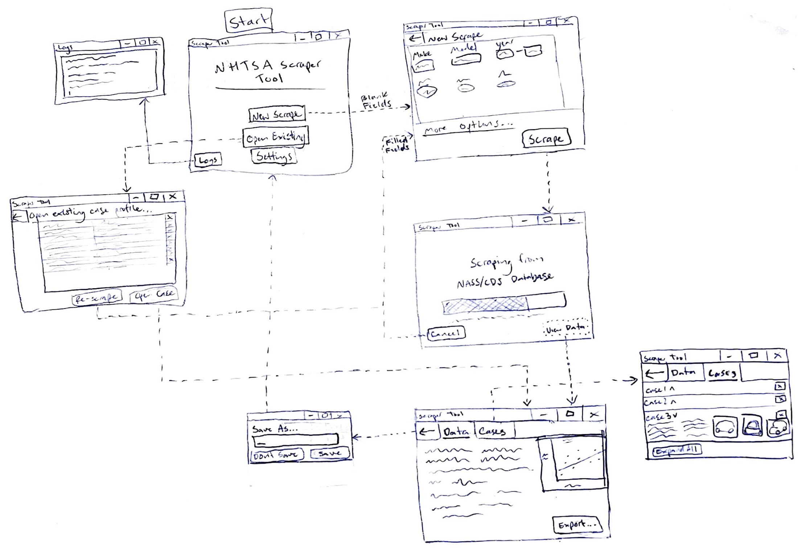

[Back to SDP Overview](README.md)

---

# User Interface (UI) Design Document

## Design Principles

- Simplicity: Keep the interface simple and uncluttered, eliminating unnecessary elements.
- Consistency: Maintain consistent visual elements, interactions, and behavior across the interface to provide a familiar and predictable experience.
- Visibility: Ensure important elements and functions are clearly visible and easy to find, avoiding hidden or obscure features.
- Efficiency: Optimize the interface to facilitate efficient completion of tasks, minimizing user effort and reducing the number of steps required.

## Target Audience

- Researchers, engineers, consultants, and other professionals who need to analyze NHTSA crash data.
- The intended audience is assumed to have some technical knowledge, but not necessarily any programming experience.
- Because this audience includes both technical and non-technical users, the interface should be simple and intuitive, but also provide enough flexibility and customization options to satisfy more advanced users.
- The interface should be clean, modern, and professional -- not too flashy or distracting.

## Wireframes and Mockups

A simple drawn wireframe is shown below. This is just a rough sketch to give an idea of the layout and general design, and is subject to slight changes in component design and positioning during implementation.

## Color Palette

- Clean and professional, with a focus on readability and usability.
- Limited to a relatively small number of colors to avoid visual clutter and maintain consistency.
- Limited to simple blues and grays (with the possibility of adding some accent colors later).
- One good looking palette that incorporates these elements is shown below:
    -  `#0B3C5D`
    -  `#328CC1`
    -  `#BFD7EA`
    -  `#F3F3F3`
    -  `#D9D9D9`
    -  `#737373`
    -  `#262626`

## Typography

- A monospace font will be used for the log viewer and any calculated or raw data. Some popular monospace fonts are:
    - Consolas
    - Courier New
    - Lucida Console
- A sans-serif font will be used for the rest of the UI. Some popular sans-serif fonts are:
    - Arial
    - Helvetica
    - Open Sans

## Responsiveness

- PyQt6's grid layout allows us to specify the size and position of each widget relative to the window size, so the interface will respond nicely to changes in windows size.
- Making the UI accomodate different screen sizes is a bit more challenging, but we can use relative sizes and positioning instead of absolute values to make the interface more flexible.

## Animation and Transitions

- To keep the interface clean and uncluttered, animations and transitions will be used sparingly.
- While the user waits for scraped data to load, a progress bar will be displayed to indicate that the app is working.

## Design Guidelines and Patterns

As can be seen in the wireframe above, most interfaces will be divided into three main sections:
- A toolbar at the top with at least one button to go back to the previous page. Additional buttons may be added to perform other actions, like what is shown in the data viewer on the bottom right.
- The main content area in the middle.
- A selection of buttons on the bottom to perform actions related to the main content area.

---

[Back to SDP Overview](README.md)